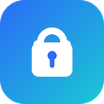

# Password Generator

A lightweight and fast Chrome extension that automatically generates a secure password and copies it to your clipboard the moment you open it.

## Features

- **Instant Generation:** Click the extension icon to instantly generate and copy a secure password.
- **Secure Defaults:** Generates a 16-character password containing uppercase letters, lowercase letters, numbers, and symbols by default.
- **Strength Meter:** A live indicator rates each password (Weak → Strong) based on its length and character variety.
- **One-Click Copy:** A dedicated copy button (with confirmation) sits alongside the password, in addition to click-to-copy.
- **Configurable (On-Demand):** Access advanced settings to customize length (4-64 characters) and character sets via compact toggle chips (uppercase, lowercase, numbers, symbols).
- **Ephemeral Settings:** To keep things secure and simple, settings are not saved between sessions. The extension always reverts to the safe default of 16 characters with all character types included.
- **Manifest V3:** Built using the latest Chrome extension standards.
- **Zero Tracking:** Operates entirely locally within your browser with no external requests or data collection.

## Installation

1. Open Chrome and navigate to `chrome://extensions/`
2. Enable "Developer mode" (toggle switch in the top right corner).
3. Click "Load unpacked" and select the `password-generator` directory from your local machine.
4. Pin the extension to your toolbar for quick access.

## Usage

1. **Click** the "Password Generator" icon in your Chrome toolbar.
2. A new password will be generated and **automatically copied to your clipboard**.
3. Paste the password wherever you need it.
4. (Optional) Need a different format? Click "Advanced Settings" to adjust the length or required characters, then click "Regenerate".

## Privacy

This extension runs completely locally. It generates passwords securely within your browser and temporarily utilizes the clipboard to copy the password for your convenience. No passwords or settings are ever saved, stored, or transmitted over the internet.
